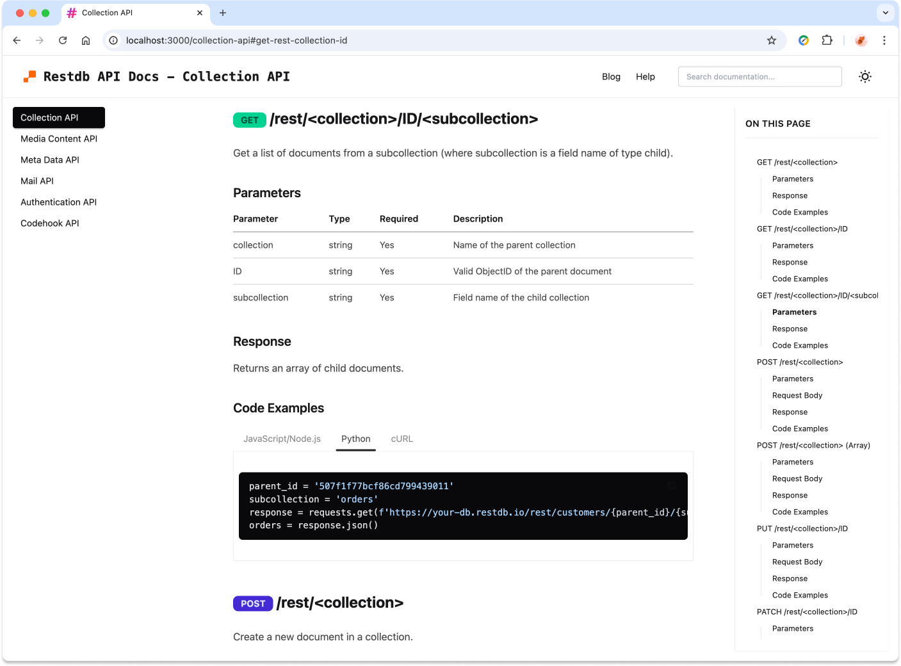

# OkiDoki - Free Static Site Generator for API Documentation & Technical Docs

[](https://www.npmjs.com/package/okidoki)
[](https://github.com/jbeejones/okidoki/blob/main/LICENSE)
[](https://github.com/jbeejones/okidoki/stargazers)

**OkiDoki** is a **free, open-source static site generator** specifically designed for creating professional **API documentation websites** and **technical documentation sites**. **Automatically generate API docs from OpenAPI/Swagger specs** or transform your **Markdown files** into beautiful, **searchable documentation** with **zero configuration** required. Perfect for **developer teams**, **software projects**, and **API providers** who need **fast documentation builds** (sub-second generation) and **lightweight, responsive websites**.

**Create beautiful API documentation with minimal effort and zero maintenance** - Completely free and open source with no subscriptions, no limits, no vendor lock-in.

Visit the full documentation at the [OkiDoki website](https://jbeejones.github.io/okidoki-website) or [Contribute on GitHub](https://github.com/jbeejones/okidoki)





## Installation & Setup

Install the **OkiDoki documentation generator** globally via npm from the [official package](https://www.npmjs.com/package/okidoki):

```bash
npm install -g okidoki
```

**System Requirements**: Node.js 14+ | **Package Size**: ~2MB | **Installation Time**: < 30 seconds
## Quick Start Guide - Create Documentation in 4 Steps

1. **Create a new documentation project directory:**
   ```bash
   mkdir mydocs && cd mydocs
   ```

2. **Initialize your documentation site:**
   ```bash
   okidoki init
   ```
   Automatically creates project structure with **configuration files** and **sample content**.

3. **Build your static documentation site:**
   ```bash
   okidoki generate
   ```
   Generates optimized HTML, CSS, and JavaScript files for deployment.
   
   > **Tip**: Use `okidoki openapi -i your-api-spec.yaml` to automatically generate API documentation from OpenAPI/Swagger files.

4. **Preview your documentation locally:**
   ```bash
   npx serve dist
   ```
   Your **documentation website** will be available at `http://localhost:3000`
   
   **Alternative web servers**: You can use any static file server - `npx node-static dist`, `python -m http.server`, or deploy to GitHub Pages, Netlify, Vercel, etc.


## Project Structure

After running `okidoki init`, you'll have:

```
mydocs/
├── docs/
│   ├── index.md        # Beautiful homepage
│   ├── start.md        # This getting started guide
│   ├── help.md         # Help and support page
│   └── test.md         # Sample content page
├── okidoki.yaml        # Main configuration
├── sidebars.yaml       # Navigation structure
└── dist/               # Generated site (after build)
```

## Basic Configuration

### okidoki.yaml
```yaml
site:
  title: "My Documentation"
  description: "Documentation for my project"
```

### sidebars.yaml
```yaml
menu:
  - title: Getting Started
    document: /start.md
  - title: API Reference
    document: /api.md
  - title: Examples
    document: /examples.md
```

## Writing Your First Page

Create a new markdown file `start.md` in the `docs/` directory:

```markdown
# My First Page

This is my first documentation page with **bold text** and `code`.

## My API Documentation

OkiDoki automatically converts your OpenAPI specs into beautiful markdown documentation:

```http
GET /api/users
Content-Type: application/json

{
  "users": [
    { "id": 1, "name": "John Doe" }
  ]
}
```
The run the `okidoki generate` command again and refresh your browser to see the updated documentation site.

## Getting Started with Your Documentation Site

- **Advanced Configuration**: Explore the [complete documentation reference](https://jbeejones.github.io/okidoki-website/reference.html) for custom themes, search optimization, and advanced features
- **Documentation Examples**: Browse [real-world Markdown examples](https://jbeejones.github.io/okidoki-website/markdown-examples.html) and templates for API docs, tutorials, and guides
- **Support & Troubleshooting**: Visit our [comprehensive help guide](https://jbeejones.github.io/okidoki-website/help.html) or [GitHub Issues](https://github.com/jbeejones/okidoki/issues) for community support

## Why Choose OkiDoki for API Documentation?

- **Automatic OpenAPI/Swagger Integration**: Generate beautiful API documentation directly from your existing OpenAPI specifications - no manual work required
- **Zero Configuration Setup**: Works out-of-the-box with sensible defaults - perfect for developers who want great docs without complexity  
- **100% Free & Open Source**: No subscriptions, no limits, no vendor lock-in - perfect for startups and enterprises
- **Lightning-Fast Build Process**: Generate complete documentation sites in under 1 second - ideal for CI/CD pipelines and rapid iteration
- **Markdown-Based Documentation**: Write in standard GitHub-flavored Markdown alongside auto-generated API docs
- **Advanced Search Functionality**: Built-in full-text search across all documentation pages with instant results
- **Professional Documentation Themes**: Beautiful, mobile-responsive themes optimized for technical content and API documentation
- **Developer-Friendly**: Perfect for GitHub workflows, automated deployments, and modern development practices  
- **Optimized Performance**: Generated sites are ~50KB with excellent Core Web Vitals scores for SEO 

## Open Source Community & Contributing

**OkiDoki** is a **community-driven open source project** and we welcome contributions from developers worldwide. Join our growing community:

- **Bug Reports & Issues** - [Report bugs](https://github.com/jbeejones/okidoki/issues) to help improve the documentation generator
- **Feature Requests** - [Suggest new features](https://github.com/jbeejones/okidoki/discussions) for API documentation and technical writing tools
- **Documentation Improvements** - Submit pull requests to enhance guides, examples, and tutorials
- **Code Contributions** - Check our [open issues](https://github.com/jbeejones/okidoki/issues) and contribute to the static site generator
- **GitHub Star** - Help other developers discover this free documentation tool by starring the repository
- **Community Support** - Help answer questions and support fellow documentation creators

## License

OkiDoki is released under the [MIT License](https://github.com/jbeejones/okidoki/blob/main/LICENSE). You're free to use, modify, and distribute it for any purpose.

## Documentation Generator Alternatives & Comparisons

Compare OkiDoki with other popular **API documentation tools** and **static site generators**:

- **[Docusaurus](https://docusaurus.io/)** - React-based documentation platform with extensive plugins (requires more setup and configuration)
- **[Slate](https://slatedocs.github.io/slate/)** - API-focused documentation generator with three-column layout (Markdown only, no OpenAPI integration)
- **[VitePress](https://vitepress.dev/)** - Vue-powered static site generator with excellent performance (requires manual API doc creation)
- **[GitBook](https://www.gitbook.com/)** - Commercial documentation platform with collaboration features (paid plans, limited OpenAPI support)
- **[MkDocs](https://www.mkdocs.org/)** - Python-based documentation generator with Material Design theme (requires plugins for OpenAPI)
- **[Nextra](https://nextra.site/)** - Next.js powered documentation framework with React components (more complex for API docs)
- **[Redoc](https://redoc.ly/)** - OpenAPI-focused tool (API docs only, no mixed content support)
- **[Jekyll](https://jekyllrb.com/)** - Ruby-based static site generator popular on GitHub Pages (requires manual setup for API docs)

**Detailed Comparison Guide**: Read our in-depth [documentation generator comparison and feature analysis](https://jbeejones.github.io/okidoki-website/documentation-generator-comparison.html) to find the best tool for your **API documentation** and **technical writing** needs.